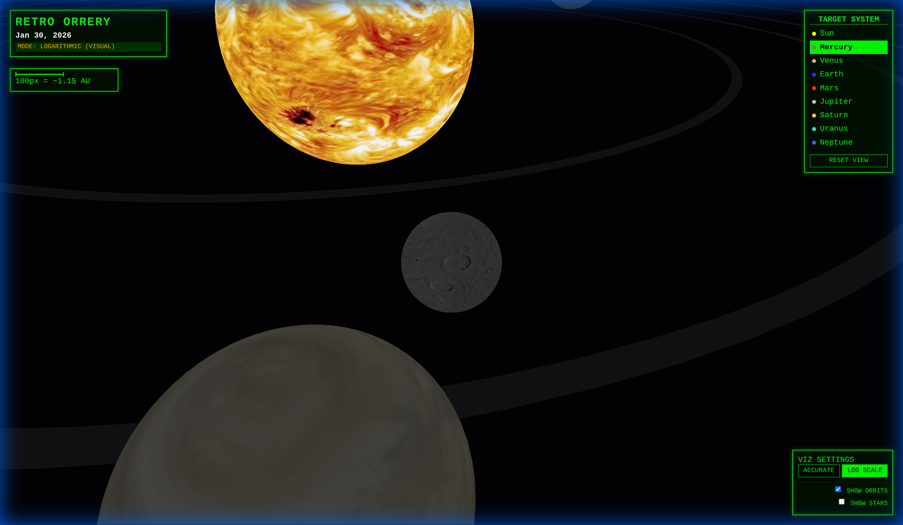
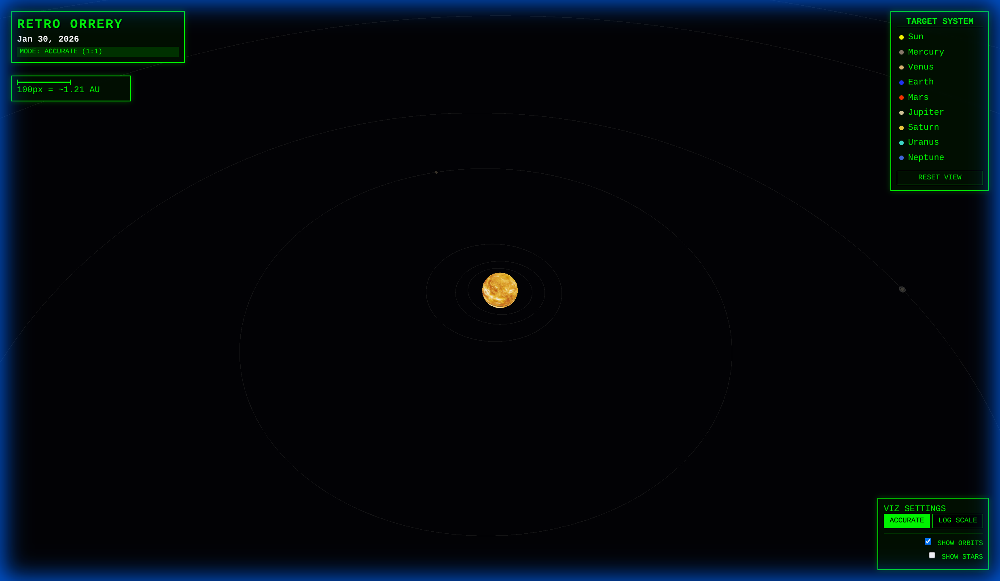
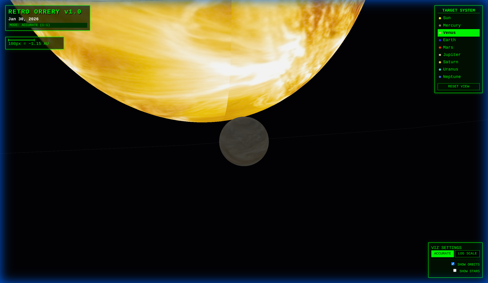
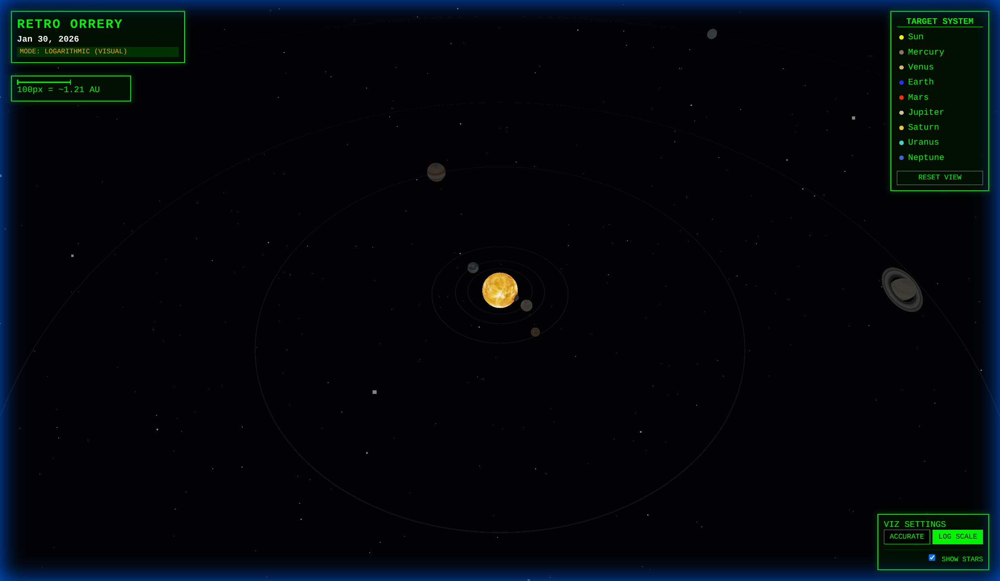

# Retro Scientific Orrery

A mathematically accurate, retro-styled solar system simulator built with **Angular 21** and **Three.js**.



## Overview

This application simulates the positions and movements of the planets in our solar system in real-time. It combines high-precision orbital mechanics with a nostalgic "command-line" aesthetic.

## 🧮 Scientific Calculations

The core of the simulation relies on the `CelestialMathService`, which calculates planetary positions using **Keplerian Orbital Elements**.

### Key Concepts

1.  **Julian Date (JD)**: 
    *   The simulation converts the current system time into a Julian Date, a continuous count of days since the beginning of the Julian Period (4713 BC). This allows for precise point-in-time astronomical calculations.
    
2.  **Keplerian Elements**:
    *   Each planet is defined by a set of static parameters (Approx. J2000 epoch):
        *   **a (Semi-major axis)**: The size of the orbit.
        *   **e (Eccentricity)**: How "stretched" the orbit is.
        *   **i (Inclination)**: The tilt of the orbit relative to the ecliptic plane.
        *   **L (Mean Longitude)**, **longPeri (Longitude of Perihelion)**, **node (Longitude of Ascending Node)**.

3.  **Position Calculation (Algorithm)**:
    *   **Mean Anomaly (M)**: Calculated based on the planet's orbital period and the time elapsed since the epoch.
    *   **Eccentric Anomaly (E)**: Solved iteratively using **Kepler's Equation**:  
        `M = E - e * sin(E)`
    *   **True Anomaly (v)**: The actual angle of the planet in its orbit.
    *   **Heliocentric Coordinates**: Finally, the 3D Position (X, Y, Z) is derived by rotating the polar coordinates into the ecliptic frame using the inclination and longitude of the ascending node.

## 🎛️ Features & Controls

### 1. Visualization Modes

The application offers two distinct scaling modes to balance scientific accuracy with visual usability.

*   **LOGARITHMIC SCALE (Default)**: 
    *   **Purpose**: Visualization and User Experience.
    *   **Behavior**: Planetary distances are compressed using a logarithmic function. This allows you to see the the inner planets (Mercury, Venus) and separate outer planets (Neptune, Uranus) on the screen simultaneously without infinite scrolling.
    *   **Planet Sizes**: Initialized to be easily visible.
    
    

*   **ACCURATE SCALE (1:1)**:
    *   **Purpose**: Scientific Realism.
    *   **Behavior**: Distances are linearly scaled. **1 Unit = 0.2 AU**. 
    *   **Result**: The space between planets is vast. You will likely see only the Sun or a single planet at a time. This mode demonstrates the true "emptiness" of space.
    
    

### 2. Interactive Navigation

*   **Target System**: Click on any planet name in the right-hand panel to automatically focus the camera on that celestial body.
*   **Dynamic Zoom**: The camera intelligently adjusts its distance based on the planet's size and the current scale mode. 
    *   *Example*: Zooming to Venus in Accurate mode brings you intimately close to the planet.
    
    

*   **Reset View**: Returns the camera to a high-level overview of the inner solar system.

### 3. Visual Toggles

Located in the **VIZ SETTINGS** panel (bottom right):

*   **SHOW ORBITS**: Toggle the visibility of the orbital paths.
    *   *Note*: The paths are dynamic `LineLoops` that update their geometry to match the active Scale Mode.
*   **SHOW STARS**: Toggle a background starfield.
    *   *Default*: **OFF** (Pitch black void for high contrast).
    *   *On*: Renders 2000 randomized stars for depth.

    

## 🛠️ Technology Stack

*   **Framework**: Angular 21 (Standalone Components, Signals)
*   **3D Engine**: Three.js
*   **Rendering**: WebGL (High Performance)
*   **Language**: TypeScript

## 🚀 Running Locally

1.  **Install Dependencies**:
    ```bash
    npm install
    ```
2.  **Start Development Server**:
    ```bash
    npm start
    ```
3.  **Navigate**: Open `http://localhost:4200` (or the port specified in the console).

---
*Retro Orrery v1.0 - 2026*
